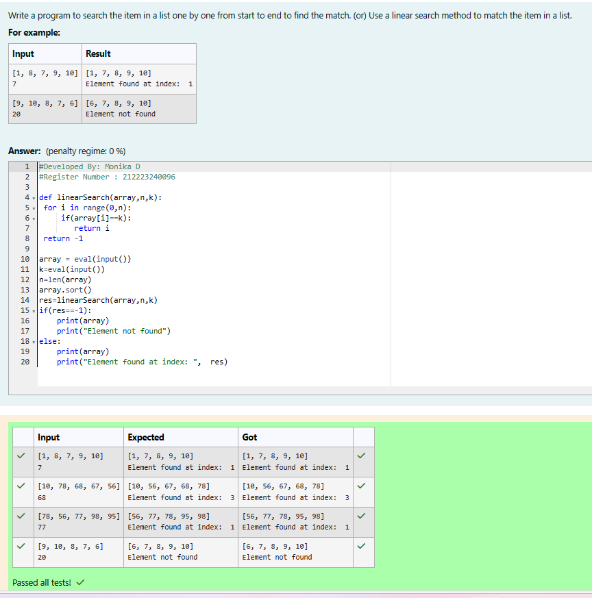
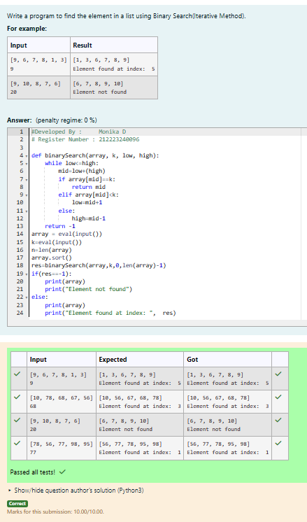

# Linear Search and Binary search
## Aim:
To write a program to perform linear search and binary search using python programming.
## Equipment’s required:
1.	Hardware – PCs
2.	Anaconda – Python 3.7 Installation / Moodle-Code Runner
## Algorithm:
## Linear Search:
1.	Start from the leftmost element of array[] and compare k with each element of array[] one by one.
2.	If k matches with an element in array[] , return the index.
3.	If k doesn’t match with any of elements in array[], return -1 or element not found.

## Binary Search:

1.	Set two pointers low and high at the lowest and the highest positions respectively.
2.	Find the middle element mid of the array ie. arr[(low + high)/2]
3.	If x == mid, then return mid.Else, compare the element to be searched with m.
4.	If x > mid, compare x with the middle element of the elements on the right side of mid. This is done by setting low to low = mid + 1
5.	Else, compare x with the middle element of the elements on the left side of mid. This is done by setting high to high = mid - 1.
6.	Repeat steps 2 to 5 until low meets high

## Program:
## 1.Use a linear search method to match the item in a list.
~~~
def binarySearchIter(array, k, low, high):
    while low<=high:
        mid=low+(high-low)//2
        if array[mid]==k:
            return mid
        elif array[mid]<k:
            low=mid+1
        else:
            high=mid-1
    return -1
array = eval(input())
array.sort()
k = eval(input()) 
print(array)
res=binarySearchIter(array,k,0,len(array)-1)
if res==-1:
    print("Element not found")
else:
    print("Element found at index: ",res)
~~~

## 2.Find the element in a list using Binary Search(Iterative Method).
~~~
def binarySearchIter(array, k, low, high):
    while low<=high:
        mid=low+(high-low)//2
        if array[mid]==k:
            return mid
        elif array[mid]<k:
            low=mid+1
        else:
            high=mid-1
    return -1
array = eval(input())
array.sort()
k = eval(input()) 
print(array)
res=binarySearchIter(array,k,0,len(array)-1)
if res==-1:
    print("Element not found")
else:
    print("Element found at index: ",res)
~~~

## 3.Find the element in a list using Binary Search (recursive Method).
~~~
def binarySearchIter(array, k, low, high):
    while low<=high:
        mid=low+(high-low)//2
        if array[mid]==k:
            return mid
        elif array[mid]<k:
            low=mid+1
        else:
            high=mid-1
    return -1
array = eval(input())
array.sort()
k = eval(input()) 
print(array)
res=binarySearchIter(array,k,0,len(array)-1)
if res==-1:
    print("Element not found")
else:
    print("Element found at index: ",res)
~~~

## Sample Input and Output
## 1.Use a linear search method to match the item in a list

## 2.Find the element in a list using Binary Search(Iterative Method)

## 3.Find the element in a list using Binary Search (recursive Method)

## Result
Thus the linear search and binary search algorithm is implemented using python programming.
